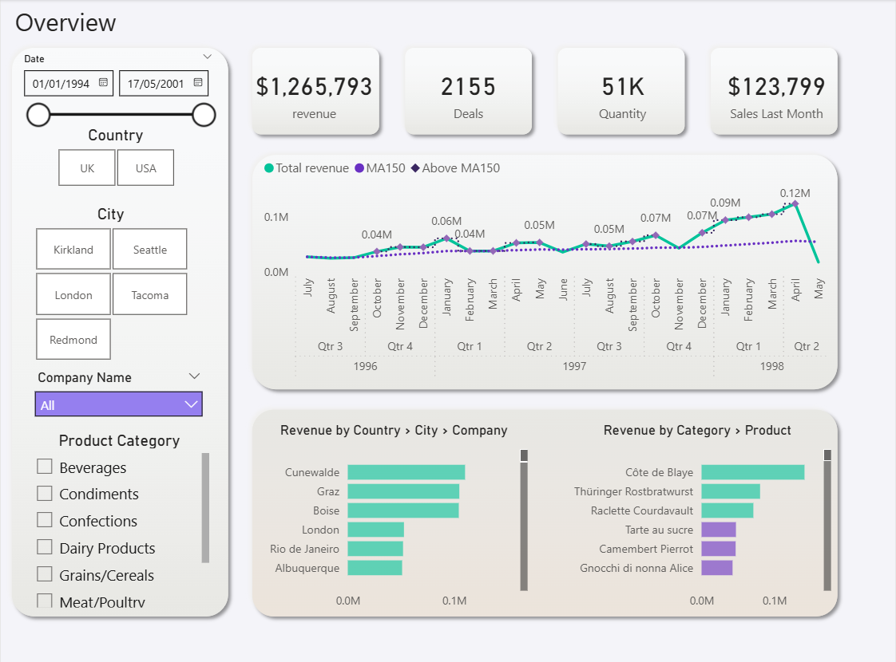
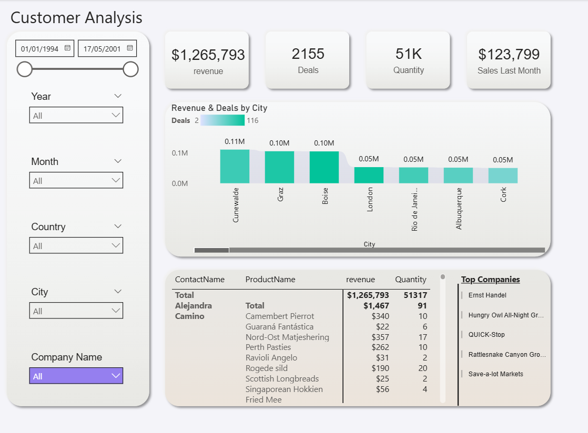
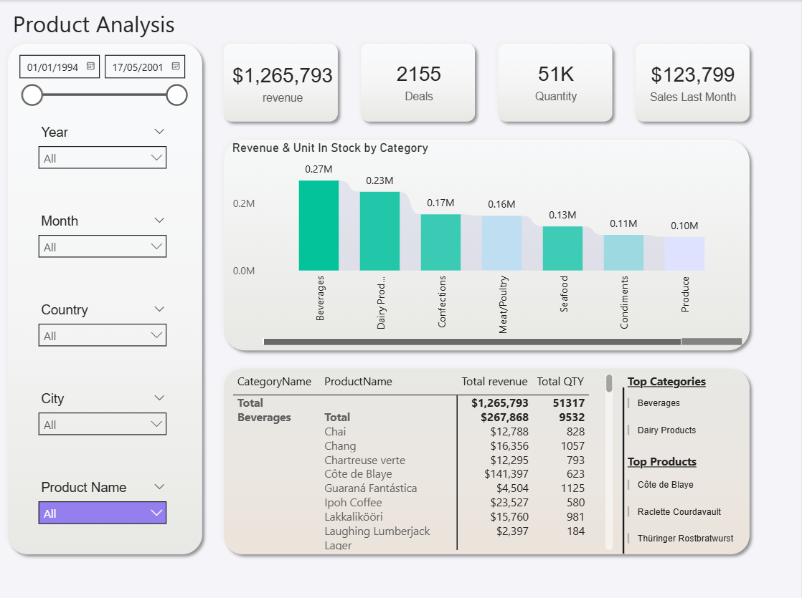
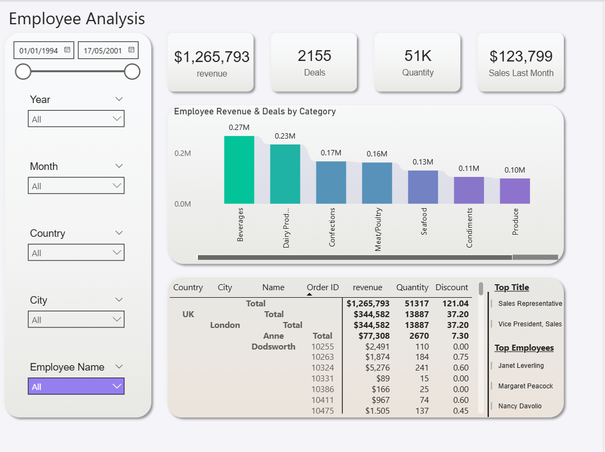
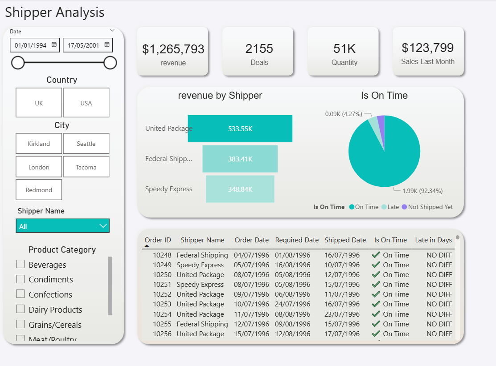

# Retail BI Dashboard – Portfolio Project

This project demonstrates a **Retail dashboard** built in **Power BI**, designed to turn sales and operations data into actionable insights.  

---

## 📊 Project Highlights
- **Overview** – High-level snapshot with KPI cards, sales trends, and revenue breakdown by **country, city, company, category, and product**, delivering real-time insights.  
- **Clients** – Customer insights with **revenue and deals by city**, a detailed customer–product table, and a list of top companies for **strategic account tracking**.  
- **Product Analysis** – Revenue and stock by category, detailed product-level insights, and identification of **top categories/products** to highlight best-sellers and gaps.  
- **Employee Analysis** – Revenue and deals by category, **drill-down by location and employee**, plus ranking of top job titles and performers.  
- **Shipper Analysis** – Revenue by shipper, **on-time delivery status**, and order details to monitor logistics and improve SLA performance.  

---

## 🖼️ Screenshots
| Screenshot | Description |
|------------|-------------|
|  | High-level KPIs, trends, and revenue breakdown |
|  | Customer insights and top companies |
|  | Product revenue and best-sellers |
|  | Employee drill-down and top performers |
|  | Shipper performance and SLA tracking |

---

## 🎥 Demo
[▶ Watch the quick demo](Quick%20video.mp4)

---

## 🚀 Tools & Skills
- **Power BI** – interactive dashboards & DAX  
- **SQL** – data modeling & ETL logic  
- **Data storytelling** – business-driven visualization  

---

## 💡 Business Value
This dashboard enables retail businesses to:  
- Gain **real-time visibility** into sales and operations  
- Track **customer behavior and product trends**  
- Identify **top performers and improvement areas**  
- Optimize **logistics and service levels**  

---

## ⚡ Outcome
A modern BI solution that provides **clear, actionable insights** across the retail value chain.
