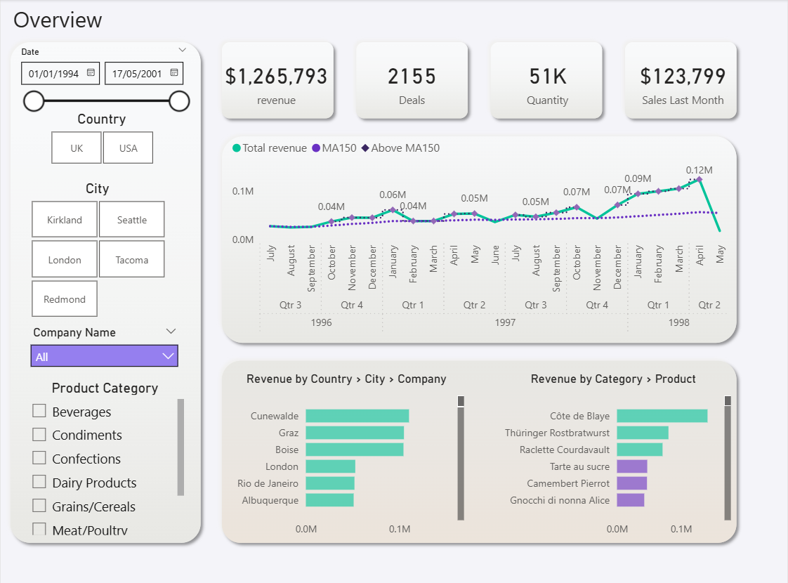
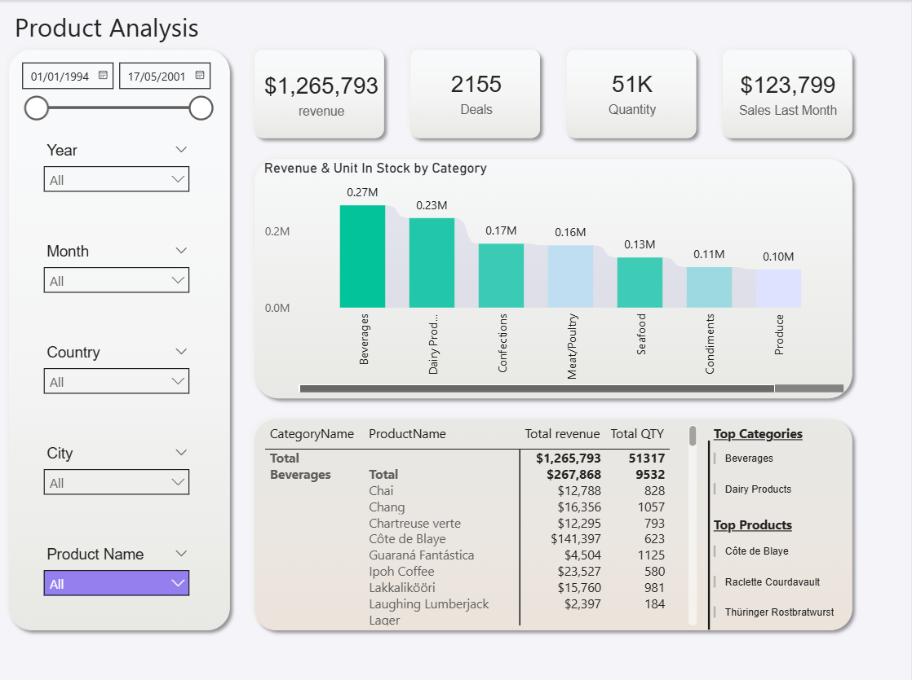
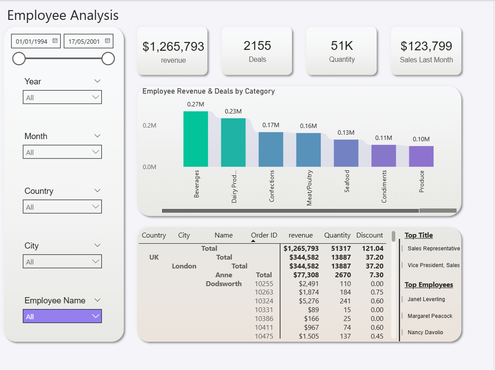
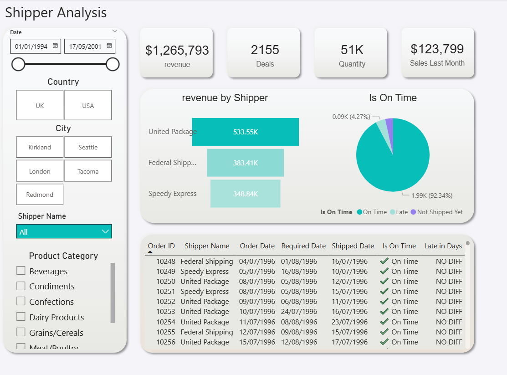
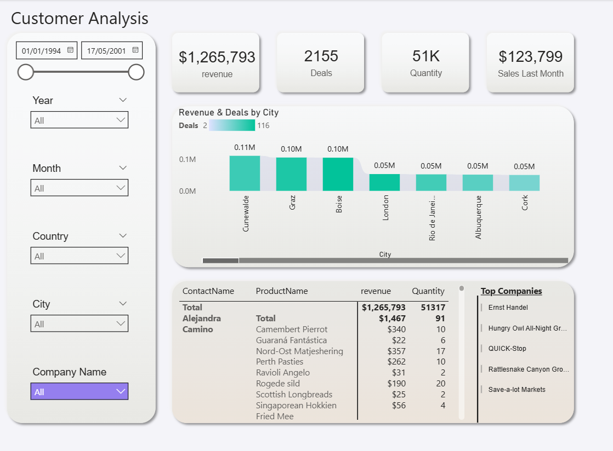

# Retail BI Dashboard – Portfolio Project

Welcome to my BI portfolio!  
This repository contains a **retail-focused dashboard project** built with **Power BI and SQL**, designed to turn raw sales data into actionable insights.  

---

## 📊 Project Highlights
- **Overview Dashboard** – Clear snapshot of sales, revenue growth, and KPIs.  
- **Product Performance** – Identify best- and worst-performing products.  
- **Customer Insights** – Segmentation, retention, and purchasing trends.  
- **Employee & Shipper Analysis** – Efficiency and delivery performance.  
- **Demo Video** – Short walkthrough of the interactive dashboard.  

---

## 🖼️ Screenshots
| Screenshot | Description |
|------------|-------------|
|  | Main KPIs and sales overview |
|  | Product performance analysis |
|  | Employee efficiency metrics |
|  | Shipper and delivery tracking |
|  | Client segmentation dashboard |

---

## 🎥 Demo
[Click here to watch the dashboard demo](Quick%20video.mp4)  

---

## 🚀 Tools & Skills
- **Power BI** → interactive dashboards & DAX  
- **SQL** → data modeling, queries, ETL logic  
- **Data Storytelling** → business-oriented visualization  
- **Portfolio Branding** → clean, fast, and insightful reports  

---

## 💡 Business Value
This project demonstrates how BI dashboards can:  
- Enable faster decision-making  
- Reveal sales and customer trends  
- Improve operational efficiency  
- Provide management with **clear, actionable insights**  

---

## ⚡ Outcome
A modern, data-driven solution that transforms retail data into a **strategic advantage**.  
